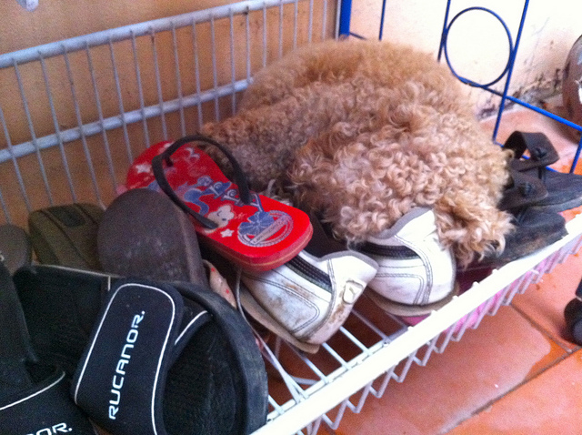

# Multimodal Image Captioning

## Introduction
Image captioning is the process of generating textual descriptions for input images. This requires a combination of **Natural Language Processing (NLP)** and **Computer Vision (CV)**. In this project, we implement an **image-to-text model** using **Vision Transformers (ViT) and GPT-2**.

## Dataset
We use the **COCO (Common Objects in Context) dataset**, a large-scale dataset with over 120K images and their respective captions.

## Model Architecture
This project uses a **Vision-Text Transformer** pipeline with an **encoder-decoder structure**:

1. **Encoder (ViT)**: Extracts visual features from an image.
2. **Decoder (GPT-2)**: Generates a sequence of words based on the visual features.
3. **Training Process**:
   - The encoder converts the image into a feature representation.
   - The decoder autoregressively generates captions word-by-word.
   - The model is fine-tuned using a sequence-to-sequence (Seq2Seq) approach.

### **Architecture Diagram**
Below is a diagram representing the **Vision Transformer + GPT-2 Encoder-Decoder Model** used in this project:

🖼️ Image → [ViT Encoder] ➝ 📄 Feature Vector ➝ [GPT-2 Decoder] → 📝 Generated Caption

## Code Files
### **1. `model.py`**
- **Function:** `setup_model()`
- Initializes the **Vision Transformer (ViT) and GPT-2** model.
- Loads the **tokenizer** and **feature extractor**.
- Saves the model in `vit-gpt2-model/`.

### **2. `data.py`**
- **Function:** `download_and_process_data()`
- Downloads and preprocesses the **COCO 2017 dataset**.
- Converts **images into feature vectors** using ViT.
- Tokenizes **text captions** using GPT-2.
- Converts the dataset into a format for **transformer training**.

### **3. `train.py`**
- **Function:** `compute_eval_metrics()`, `refine_text()`
- Loads the model and dataset.
- Uses **Hugging Face's `Seq2SeqTrainer`** for training.
- Computes **ROUGE Score** for evaluation.
- Saves the trained model in `captioning-results/`.

## Training Results
Here are some generated captions from the trained model:

| **Image** | **Generated Caption** |
|-----------|----------------------|
|  | **"Closeup of bins of food that include broccoli and bread."** |
|  | **"Various slides and other footwear rest in a metal basket outdoors."** |
|  | **"A picture of a dog laying on the ground."** |

## Running the Project
### **1. Install Dependencies**
```bash
pip install transformers datasets evaluate nltk pillow torch
```

### **2. Train the Model**
```bash
python train.py
```

### **3. Run Inference**
After training, generate captions using:
```python
from transformers import pipeline
caption_generator = pipeline("image-to-text", model="./captioning-results")
print(caption_generator("test_image.jpg"))
```

---

This README provides a **complete overview** of your project! 🚀
